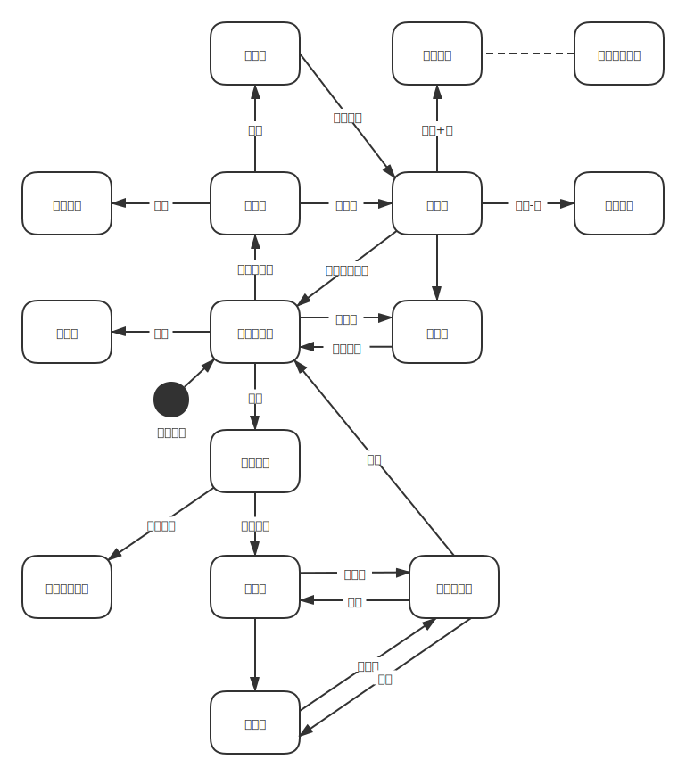

# 读经打卡软件设计文档

<!-- TOC -->

- [概述](#概述)
- [术语表](#术语表)
- [功能及用例](#功能及用例)
  - [首页登录](#首页登录)
  - [每日打卡](#每日打卡)
  - [设置打卡提醒](#设置打卡提醒)
  - [查看统计图](#查看统计图)
  - [查看卷进度](#查看卷进度)
  - [按日期查看打卡记录](#按日期查看打卡记录)
  - [新建群](#新建群)
  - [赐除成员](#赐除成员)
  - [修改群昵称](#修改群昵称)
  - [加入群](#加入群)
  - [删除或退出群](#删除或退出群)
  - [查看群消息](#查看群消息)
  - [查看群排行榜](#查看群排行榜)
  - [设置默认群](#设置默认群)
- [页面及跳转](#页面及跳转)

<!-- /TOC -->

## 概述

本软件是一个读经打卡软件，实现打卡、查看打卡记录、查看排行榜和群功能。

## 术语表

本文档中使用了一些术语，下表给出了这些术语的解释。

| 术语         | 解释                                   |
| ------------ | -------------------------------------- |
| 来源群       | 用户进入其他用户的主页之前经过的群     |
| 群排行生效日 | 新建群时设置的排行有效时间中的起始日期 |

## 功能及用例

以下是用例列表，代表系统的主要功能，删除线代表没有此功能：

- [ ] 首次登录
- 打卡管理
  - [ ] 每日打卡
  - [ ] 设置打卡提醒
  - [ ] 查看统计图
  - [ ] 查看卷进度
  - [ ] 按日期查看打卡记录
- 群管理
  - [ ] 新建群
  - [ ] 赐除成员
  - ~~修改群名称~~
  - [ ] 修改群昵称
  - [ ] 加入群
  - [ ] 删除或退出群
  - [ ] 查看群消息
  - [ ] 查看群排行榜
  - [ ] 设置默认群

以下对每个用例进行较为详细的描述，其中使用到的页面名称可参考下一小节（[页面及跳转](#页面及跳转)）：

### 首页登录

- 用户首次进入小程序时，会获取用户的微信头像、昵称等信息，作为用户在小程序中头像和昵称
- 用户的头像和昵称后期不可修改，也不可重新从微信获取

### 每日打卡

1. 用户进入打卡界面，选择卷和章
2. **每章右上角的数字代表用户注册以来打卡该章的次数**
3. 用户点击章时，将章加入待打卡列表，并高亮章
4. 用户点击高亮的章时，将该章从待打卡列表中移除
5. 用户通过悬浮按钮可进入待打卡列表，悬浮按钮上用小数字代表当前列表中的总章数
6. 待打卡列表中**每条数据仅包含一章**，删除前弹窗确认
7. 点击确认按钮提交，成功后返回用户个人页
8. **待打卡列表不会自动清空，也不会自动提交**

### 设置打卡提醒

1. 在设置页可开启和关闭打卡提醒
2. 到达提醒时间时会在**微信会话页**的服务通知中发送一条消息，点开可进入**选择打卡卷**页面

### 查看统计图

在个人主页中显示用户在默认群的打卡数据拆线图，可按周视图和总视图查看，**默认查看周视图**。

- 按周视图查看时，横坐标代表开始统计以来的周数，纵坐标代表每周打卡的总章数
- 按总视图查看时，横坐标代表开始统计以来的周数，纵坐标代表从起始日期开始到该周为止累计打卡的总章数
- 查看自己的个人主页时，是从首次登录时开始统计
- 查看别人的个人主页时，是从来源群的群排行生效日开始统计

### 查看卷进度

在个人主页中显示每卷书的打卡进度和已读整卷次数。

- 进度条显示用户阅读该卷书的章数覆盖率，**计算公式为：开始统计以来用户阅读该卷书的非重复章数 ÷ 该卷书包含的总章数**
- 已读整卷次数代表用户完整阅读该卷书的次数，**计算公式为：开始统计以来用户阅读该卷书中各章的次数的最小值**
- 查看自己的个人主页时，是从首次登录时开始统计
- 查看别人的个人主页时，是从来源群的群排行生效日开始统计

### 按日期查看打卡记录

- 用户进入打卡记录页面时，按时间从近到远显示用户每日的打卡记录，上拉可加载更多
- 用户可通过顶部的日期组件选择年月，以快速定位到某个月的打卡记录，**此时仍可上拉或下拉加载其他月份的数据**
- 用户在滑动列表时，顶部的日期自动更新

### 新建群

1. 用户进入新建组页面，填写以下信息：
   - 群名称
   - 排行有效时间，包括开始日期和结束日期
   - 用户申请入群时是否需要群主验证
2. **点击提交后，以上信息皆不可再次修改**
3. 创建成功后创建者成为群主，跳转到群设置页面，此时点返回会回到群列表页

### 赐除成员

**群主**可赐队组内的成员，步骤如下：

1. 进入群设置页
2. 点击成员列表后面的-号，进入删除成员的状态，此时成员的头像会出现右上角带-号的灰色边框，-号变成 ✓
3. 点击要删除的用户，该用户的头像边框会变成红色
4. 点击 ✓ 号，弹出删除确认框，确认删除

### 修改群昵称

用户加入群时的昵称为用户个人信息中的昵称，后期可在群设置中修改。

### 加入群

**群中的任意用户**可邀请其他用户加入群，步骤如下：

1. 进入群设置页
2. 点击成员列表后面的+号，或者点击“邀请新成员”，进入群邀请页
3. 群邀请页显示小程序码，其他用户使用微信扫码后进入群邀请确认页

   - 3.a. 也可以将邀请页转发到微信会话中，用户点击小程序卡片进入群邀请确认页

4. 用户在群邀请确认页点确认加入按钮即可加入群聊

异常流程：

- 3.a. 用户进入邀请确认页时没有登录，则把确认加入按钮改为登录并确认加入
- 4.a. 用户点击确认入群，群主设置了入群时验证，用户再次进入入群邀请确认页时，显示正在等待群主验证

### 删除或退出群

1. 用户进入群设置页
2. 点击退出群（群主为“删除并退出”），弹出退出确认提示框
3. 点出确认后，用户将退出该群，如果是群主，则所有成员退出该群
4. 退出群后，用户不可再查看该群的统计数据

### 查看群消息

用户可查看的群消息如下：

- 群主可查看用户入群申请，并通过或拒绝该用户
- 群被解散时，群主之外的用户会收到解散通知
- 用户被赐出群时，会收到被移出的通知

**群消息不可搜索**，只能按时间顺序查看，且只能用户手动进入查看，**不会**发送服务通知。

### 查看群排行榜

- 用户在群列表页点击群时，可查看在该群中的排行榜。也可通过首页下方的排行榜 tab 页查看默认群的排行榜。
- 排行榜分为总排行和周排行，排行以章数排序
- 总排行中用星号代表**用户通读圣经的次数，该次数的计算公式是：自群排行生效日以来所有卷中所有章阅读次数的最小值**
- **周排行没有星号**

### 设置默认群

1. 用户进入群设置页
2. 点击“设为默认群按钮”，弹出确认提示框
3. 点击确认后设置为默认群

## 页面及跳转

